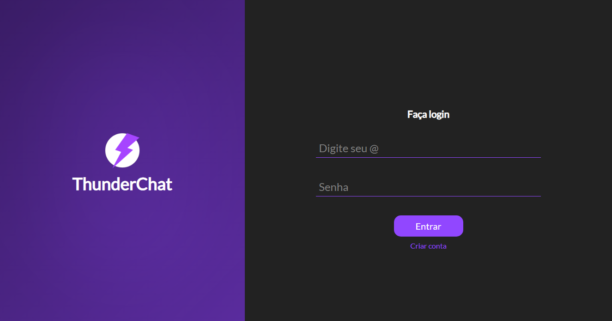
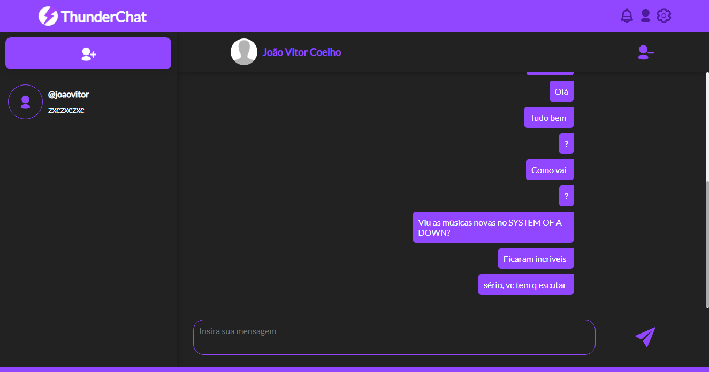
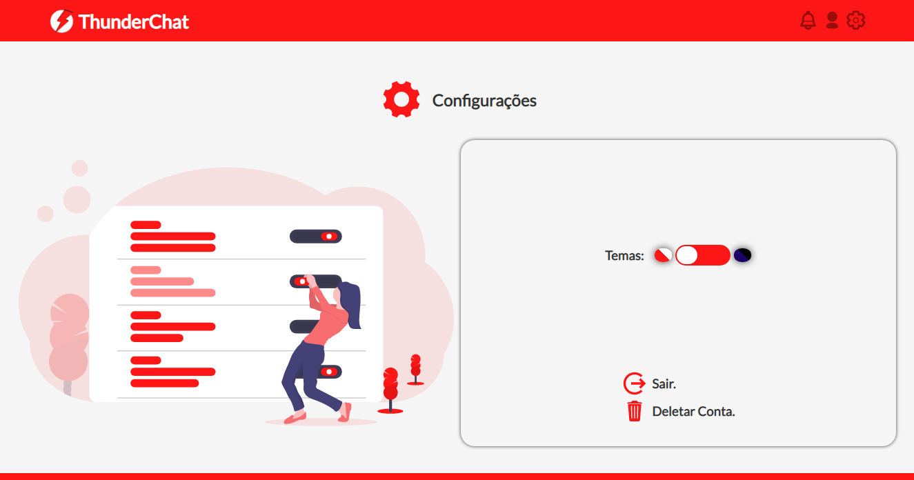
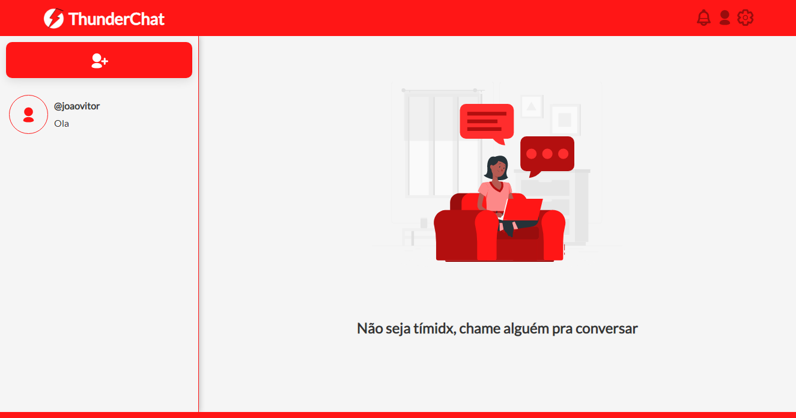

<h1> Thunderchat - Chat em tempo real </h1>

<p align="center">
    
    
</p>

<hr> 
<div align="center">
    
    
</div>

## Instalação

<p>
Primeiramente clone o repositorio em seu ambiente de desenvolvimento. Após, execute o seguinte comando:
</p> 

```sh
npm install (ou) yarn install
```

<p>Depois, é só usar o app :D:</p>


## Atualizações futuras:
1. Adicionar feature que permite que o usuário faça o upload de fotos de perfil.
2. Um app mobile, talvez(?).

## Redes Sociais e Contato
1. [Twitter](https://twitter.com/andr3zinh000)
2. Gmail: andrelp1015@gmail.com

Obrigado por acompanhar o projeto :D


